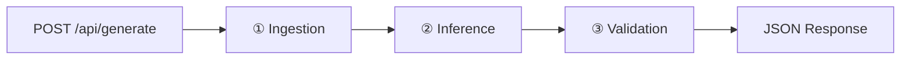

# ARCHITECTURE_MANIFEST.md — Gitlore

> **For:** Coding agent execution in autonomous mode.
> **Constraint:** $0.00 operational cost. No API keys. No cloud calls. No exceptions.

---

## 1. System Topology

Three modules in a synchronous pipeline. No queues, no workers, no over-engineering.



| Module | Responsibility | I/O |
|--------|---------------|-----|
| **Ingestion** | Fetch repo metadata + pack source files into a context string | `(owner, repo)` → `RepoContext` |
| **Inference** | Send context to local Ollama, receive structured JSON | `RepoContext` → `RawLLMOutput` |
| **Validation** | Zod-parse output, validate Mermaid syntax | `RawLLMOutput` → `GitloreOutput` |

### Data Flow Types

```
Request → { owner: string, repo: string, context?: string }
RepoContext → { readme: string, packageInfo: object, fileTree: string[], packedSource: string }
RawLLMOutput → string (raw JSON from Ollama, parsed inline)
GitloreOutput → validated object matching the Solution Data Contract (§3)
```

---

## 2. File Tree

```
gitlore/
├── src/
│   ├── index.ts                    # Hono app + @hono/node-server bootstrap
│   ├── routes/
│   │   └── generate.ts             # POST /api/generate handler
│   ├── modules/
│   │   ├── ingestion/
│   │   │   ├── github.ts           # GitHub REST API client (native fetch, no SDK)
│   │   │   ├── packer.ts           # Source file packer (priority tiers, token budget)
│   │   │   └── types.ts            # RepoContext, FileEntry types
│   │   ├── inference/
│   │   │   ├── ollama.ts           # Ollama native API client — THE ONLY LLM INTERFACE
│   │   │   ├── prompt.ts           # System + user prompt assembly
│   │   │   └── guard.ts            # Zero-API guard — blocks non-local endpoints
│   │   └── validation/
│   │       ├── schema.ts           # Zod parse + Mermaid syntax check
│   │       └── mermaid.ts          # Mermaid syntax validator (regex-based, no heavy deps)
│   ├── schemas/
│   │   ├── request.ts              # Zod schema for POST body
│   │   └── response.ts             # Zod schema for GitloreOutput (the data contract)
│   └── lib/
│       ├── constants.ts            # Token budgets, file extension allowlists, model defaults
│       ├── errors.ts               # Typed error classes
│       └── config.ts               # Centralized config from process.env with defaults
├── .env.example
├── .gitignore
├── package.json
├── tsconfig.json
└── README.md
```

**14 source files. No barrel files. No DI containers.**

---

## 3. The Solution Data Contract (Zod Schema)

See `src/schemas/response.ts` for the exact Zod schema implementation.

---

## 4. Zero-API Policy — HARD ENFORCEMENT

> **CAUTION:** The inference module must be **physically incapable** of calling any non-local endpoint.

### Two-Layer Defense:

1. **`src/lib/config.ts`** — `assertLocalEndpoint()` runs at import time. Crashes the process if `OLLAMA_BASE_URL` is not a loopback address.
2. **`src/modules/inference/guard.ts`** — `guardedFetch()` wraps `fetch()` at runtime. Blocks known cloud LLM providers AND any non-loopback hostname.

### Why Native Ollama API, Not OpenAI-Compatible

| | Native `/api/chat` | OpenAI-compat `/v1/chat/completions` |
|--|---------------------|--------------------------------------|
| **JSON Schema enforcement** | Pass schema in `format` field | Experimental, often ignored |
| **Stability** | Stable, documented | Explicitly experimental |
| **Dependencies** | Zero — raw `fetch()` | Would tempt importing `openai` SDK |

**Decision: Use Ollama's native `/api/chat` endpoint exclusively.**

---

## 5. pnpm Scripts & Local Workflow

```json
{
  "dev": "tsx watch src/index.ts",
  "start": "tsx src/index.ts",
  "typecheck": "tsc --noEmit",
  "check:ollama": "curl -sf http://127.0.0.1:11434/api/tags > /dev/null && echo '✓ Ollama running' || echo '✗ Start Ollama: ollama serve'",
  "predev": "pnpm run check:ollama",
  "health": "curl -sf http://localhost:3000/ && echo ' ✓ OK' || echo ' ✗ Down'"
}
```

### Runtime Deps (4 total): hono, @hono/node-server, zod, zod-to-json-schema
### Dev Deps (3 total): tsx, typescript, @types/node

---

## 6. MUST NOT Rules

1. **MUST NOT** install `openai`, `@anthropic-ai/sdk`, `groq-sdk`, `@google/generative-ai`, or any cloud LLM client.
2. **MUST NOT** `fetch()` any non-loopback address for inference.
3. **MUST NOT** use `/v1/chat/completions`. Use native `/api/chat`.
4. **MUST NOT** introduce Docker or containerization.
5. **MUST NOT** use Octokit or any GitHub SDK.
6. **MUST NOT** create barrel files. Import directly.
7. **MUST NOT** use `dotenv` package. `tsx` handles `.env` natively.
8. **MUST NOT** add any dep requiring account registration or expiring free-tier.

---

## 7. Git Commit Roadmap

Each commit = verified checkpoint. Conventional Commits. Commit **only** after verification passes.

| # | Commit Message | Verification |
|---|---------------|-------------|
| 1 | `chore: initialize project skeleton` | `pnpm install` + `pnpm typecheck` exit 0 |
| 2 | `feat: add config module with zero-api guard` | Boot OK. `OLLAMA_BASE_URL=https://api.openai.com` → process crashes with BLOCKED. |
| 3 | `feat: add request and response Zod schemas` | `pnpm typecheck`. Reject malformed input. |
| 4 | `feat: add ingestion module` | Fetch `denoland/deno` README → non-empty string. |
| 5 | `feat: add inference module with Ollama native client` | **Verified local inference connectivity.** `analyzeWithOllama()` returns valid JSON. |
| 6 | `feat: add validation module` | Good Mermaid → pass. Bad Mermaid → fail. Both correct. |
| 7 | `feat: wire pipeline into API route` | `curl POST /api/generate` → valid `GitloreOutput`. End-to-end. |
| 8 | `feat: add error handling middleware` | Missing body→400, bad repo→404, Ollama down→503. |
| 9 | `docs: add README with setup instructions` | Docs complete. `pnpm dev` workflow documented. |
| 10 | `chore: finalize .env.example and .gitignore` | `.env` gitignored. No secrets in repo. Clean for push. |

---

*Zero cloud. Zero keys. Zero cost. Ship it.*
