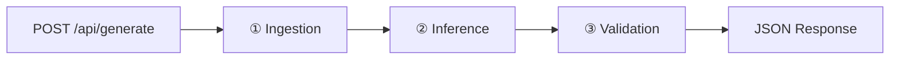

# ARCHITECTURE_MANIFEST.md — Gitlore

> **Runtime:** Cloudflare Workers (Free Tier)
> **Inference:** Cerebras Cloud (Free Tier)
> **Cost:** $0.00/month

---

## 1. System Topology

Three modules in a synchronous pipeline, executing on Cloudflare's edge network.



| Module | Responsibility | I/O |
|--------|---------------|-----|
| **Ingestion** | Fetch repo metadata + pack source files into a context string | `(owner, repo, config)` → `RepoContext` |
| **Inference** | Send context to Cerebras Cloud, receive structured JSON via SSE | `(RepoContext, config)` → `RawLLMOutput` |
| **Validation** | Zod-parse output, validate Mermaid syntax | `RawLLMOutput` → `GitloreOutput` |

### Data Flow Types

```
Request → { owner: string, repo: string, context?: string }
RepoContext → { readme: string, packageInfo: object, fileTree: string[], packedSource: string }
RawLLMOutput → string (raw JSON from Cerebras, parsed inline)
GitloreOutput → validated object matching the Solution Data Contract (§3)
```

### Config Architecture

Workers provide environment variables per-request via the `env` binding. There is no module-level singleton.

```
c.env (Hono context) → getConfig(env) → AppConfig → passed to modules as parameter
```

---

## 2. File Tree

```
gitlore/
├── src/
│   ├── index.ts                    # Hono app, default export for Workers
│   ├── routes/
│   │   └── generate.ts             # POST /api/generate handler
│   ├── modules/
│   │   ├── ingestion/
│   │   │   ├── github.ts           # GitHub REST API client (native fetch, no SDK)
│   │   │   ├── packer.ts           # Source file packer (priority tiers, token budget)
│   │   │   └── types.ts            # RepoContext, FileEntry types
│   │   ├── inference/
│   │   │   ├── cerebras.ts         # Cerebras Cloud API client (SSE streaming)
│   │   │   └── prompt.ts           # System + user prompt assembly
│   │   └── validation/
│   │       ├── schema.ts           # Zod parse + Mermaid syntax check
│   │       └── mermaid.ts          # Mermaid syntax validator (regex-based)
│   ├── schemas/
│   │   ├── request.ts              # Zod schema for POST body
│   │   └── response.ts             # Zod schema for GitloreOutput (data contract)
│   └── lib/
│       ├── constants.ts            # File extension allowlists, priority files, entry points
│       ├── errors.ts               # Typed error classes
│       └── config.ts               # getConfig(env) + Bindings type + AppConfig interface
├── wrangler.toml                   # Cloudflare Workers configuration
├── .dev.vars                       # Local dev secrets (gitignored)
├── .gitignore
├── package.json
├── tsconfig.json
└── README.md
```

**12 source files. No barrel files. No DI containers.**

---

## 3. The Solution Data Contract (Zod Schema)

See `src/schemas/response.ts` for the exact Zod schema implementation.

---

## 4. Environment & Secrets

### Secrets (via `wrangler secret put`)
| Name | Required | Description |
|------|----------|-------------|
| `CEREBRAS_API_KEY` | ✅ | Cerebras Cloud API key (free tier) |
| `GITHUB_PAT` | Optional | GitHub Personal Access Token (increases rate limit to 5,000/hr) |

### Environment Variables (in `wrangler.toml`)
| Name | Default | Description |
|------|---------|-------------|
| `CEREBRAS_MODEL` | `llama3.1-8b` | Model to use for inference |
| `MAX_CONTEXT_CHARS` | `12000` | Max characters of source code to pack |

---

## 5. Cloudflare Workers Free Tier Constraints

| Limit | Value | Impact |
|-------|-------|--------|
| Requests | 100,000/day | More than sufficient |
| CPU Time | 10ms/request | Safe — external fetch() calls don't count |
| Subrequests | 50/request | Safe — typically 5-15 per generate call |
| Script Size | 1 MB gzipped | Safe — ~25KB source + minimal deps |

> **CPU Time Note:** The Worker spends almost all its time waiting on external API calls (GitHub, Cerebras). These are I/O waits and do NOT count toward the 10ms CPU limit. Only JSON parsing and Zod validation consume CPU, which is negligible.

---

## 6. pnpm Scripts

```json
{
  "dev": "wrangler dev",
  "deploy": "wrangler deploy",
  "typecheck": "tsc --noEmit",
  "health": "curl -sf http://localhost:8787/ && echo ' ✓ OK' || echo ' ✗ Down'"
}
```

### Runtime Deps (3 total): hono, zod, zod-to-json-schema
### Dev Deps (3 total): wrangler, typescript, @cloudflare/workers-types

---

## 7. MUST NOT Rules

1. **MUST NOT** install `openai`, `@anthropic-ai/sdk`, `groq-sdk`, `@google/generative-ai`, or any cloud LLM client SDK.
2. **MUST NOT** use `process.env` — Workers provide env via the `env` binding.
3. **MUST NOT** use `process.stdout.write` — Workers do not have `process.stdout`.
4. **MUST NOT** use `@hono/node-server` — Workers use the default export pattern.
5. **MUST NOT** use Octokit or any GitHub SDK.
6. **MUST NOT** create barrel files. Import directly.
7. **MUST NOT** store secrets in `wrangler.toml` — use `wrangler secret put`.

---

## 8. Git Commit Strategy

Conventional Commits. Commit only after verification passes.

---

*Zero cloud cost. Edge-deployed. Ship it.*
