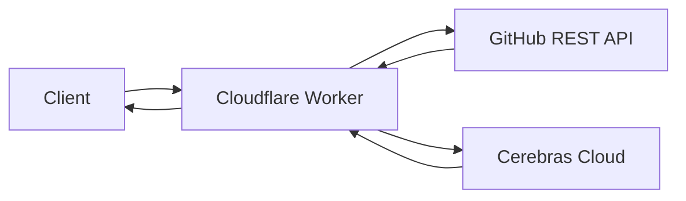

# ⚡ Gitlore
**Portfolio Intelligence API — Deployed on Cloudflare Workers. Powered by Cerebras Cloud.**

Gitlore transforms any GitHub repository into a structured, high-impact technical case study. It runs on **Cloudflare Workers** (free tier) with **Cerebras Wafer-Scale inference**, generating production-grade architectural analysis in seconds at zero cost.

> [!NOTE]
> Gitlore is completely free to run. Cloudflare Workers free tier provides 100,000 requests/day, and Cerebras Cloud provides free LLM inference. No credit card required.

## 🏗️ Architecture



| Layer | Technology | Role |
|-------|-----------|------|
| **Edge Runtime** | [Cloudflare Workers](https://workers.cloudflare.com) | Request handling, orchestration |
| **Framework** | [Hono](https://hono.dev) | Lightweight HTTP routing |
| **Inference** | [Cerebras Cloud](https://cloud.cerebras.ai) (Llama 3.1-8B) | Structured portfolio generation |
| **Data Source** | [GitHub REST API](https://docs.github.com/en/rest) | Repository ingestion |
| **Validation** | [Zod](https://zod.dev) | Strict JSON schema enforcement |
| **Visuals** | [Mermaid.js](https://mermaid.js.org) | Dynamic architecture diagrams |

### Request Pipeline

```
POST /api/generate
  ① Ingestion  → Fetch repo metadata, README, file tree, source files from GitHub
  ② Inference  → Stream context to Cerebras Cloud, receive structured JSON
  ③ Validation → Zod schema parse + Mermaid syntax check
  → JSON Response
```

## 🚀 Performance
Results from sequential stress tests (Cerebras Llama 3.1-8B):

| Metric | Result |
|--------|--------|
| **Average Latency** | **8.68s** |
| **Fastest Run** | **7.86s** |
| **Throughput** | ~1,200 tokens/sec |
| **Reliability** | 100% (5/5 successful runs) |

## 📦 Setup

### Prerequisites
- [Cloudflare account](https://dash.cloudflare.com/sign-up) (free)
- [Cerebras API key](https://cloud.cerebras.ai) (free)
- [Node.js](https://nodejs.org) ≥ 18
- [pnpm](https://pnpm.io)

### 1. Clone & Install
```bash
git clone https://github.com/simon-escano/gitlore.git
cd gitlore
pnpm install
```

### 2. Configure Secrets
```bash
# Log in to Cloudflare
npx wrangler login

# Set your Cerebras API key (required)
npx wrangler secret put CEREBRAS_API_KEY

# Set a GitHub PAT for higher rate limits (optional, but recommended)
npx wrangler secret put GITHUB_PAT
```

### 3. Local Development
```bash
pnpm dev
# → Starts local Workers dev server at http://localhost:8787
```

Create a `.dev.vars` file for local development secrets:
```env
CEREBRAS_API_KEY=your_key_here
GITHUB_PAT=your_github_pat_here
```

### 4. Deploy to Cloudflare
```bash
pnpm run deploy
# → Deploys to https://gitlore.<your-subdomain>.workers.dev
```

## 🎮 Usage

```bash
curl -X POST https://gitlore.<your-subdomain>.workers.dev/api/generate \
  -H "Content-Type: application/json" \
  -d '{
    "url": "https://github.com/simon-escano/gitlore",
    "title": "Gitlore - Portfolio Intelligence API",
    "role": "Lead Architect",
    "context": "Demonstrating high-performance LLM orchestration on the edge."
  }'
```

### Response Features
Returns a structured JSON payload ready for your portfolio site:
- **`_thinking`**: Chain-of-thought architectural analysis.
- **`architecture_diagram_code`**: File-level Mermaid.js system map.
- **`results`**: Qualitative and quantitative impact metrics.
- **`stack`**: Automatic tech stack discovery with roles.
- **`key_features`**: High-impact feature highlights with Lucide icons.

## 📊 Scripts
| Script | Description |
|--------|-------------|
| `pnpm dev` | Start local Workers dev server |
| `pnpm run deploy` | Deploy to Cloudflare Workers |
| `pnpm run typecheck` | Run TypeScript type checking |

## 💰 Cost Breakdown

| Service | Tier | Limit | Cost |
|---------|------|-------|------|
| Cloudflare Workers | Free | 100,000 req/day | **$0** |
| Cerebras Cloud | Free | Rate-limited | **$0** |
| GitHub REST API | Free (with PAT) | 5,000 req/hr | **$0** |
| **Total** | | | **$0/month** |

## 🛡️ License
MIT
