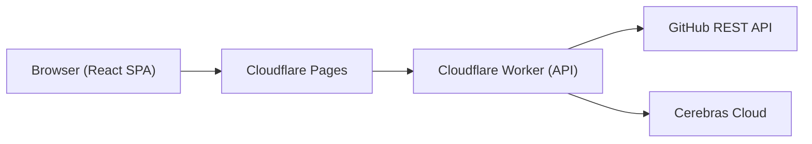

# ⚡ Gitlore

**Portfolio Intelligence Platform — React GUI + API on Cloudflare's Edge.**

Gitlore transforms any GitHub repository into a structured, high-impact technical case study. The API runs on **Cloudflare Workers** and the frontend on **Cloudflare Pages** — both on the free tier at zero cost.

### 🔗 Try It Live
* 🌐 **React SPA Dashboard**: [https://web.gitlore.workers.dev](https://web.gitlore.workers.dev)
* ⚙️ **REST API Gateway**: [https://api.gitlore.workers.dev](https://api.gitlore.workers.dev)

> [!NOTE]
> Gitlore is completely free to run. Cloudflare Workers (100K req/day), Cloudflare Pages (unlimited sites), and Cerebras Cloud (free inference) — no credit card required.

---

## 🏗️ Architecture



This is a **pnpm monorepo** with two packages:

```
gitlore/
├── api/                    # Cloudflare Worker — Hono REST API
│   ├── src/
│   │   ├── index.ts        # Hono app with CORS
│   │   ├── routes/         # /api/generate + /api/generate/stream (SSE)
│   │   ├── modules/        # Ingestion (subrequest budget-capped), inference, validation
│   │   ├── schemas/        # Zod request/response schemas
│   │   └── lib/            # config, errors, constants, progress
│   ├── wrangler.toml
│   └── package.json
├── web/                    # Cloudflare Pages — React + Tailwind v4
│   ├── src/
│   │   ├── App.tsx         # Main app shell & workspaces
│   │   ├── components/     # Live JSON, Interactive Mermaid canvas editors
│   │   ├── layouts/        # Customizable portfolio layout
│   │   ├── lib/            # SSE client, theme, queue state
│   │   └── types/          # Frontend type definitions
│   ├── wrangler.toml
│   └── package.json
├── package.json            # Workspace root
└── pnpm-workspace.yaml
```

---

## 🖥️ Frontend & Workspace Features

| Feature | Description |
|---------|-------------|
| **Real-time Stages Progress** | SSE streaming captures step-by-step progress categorized into Ingestion, Inference, and Validation. Shows in a frosted Glassmorphism backdrop modal. |
| **Interactive Diagram Canvas** | Dual-pane Mermaid.js section showing live-rendered SVGs and a text editor simultaneously. Supports pan-and-zoom and real-time live editing of the architecture diagram. |
| **Live JSON Workspace Editor** | Syntax-highlighted, interactive JSON code editor with a floating copy-code trigger. Live edits synchronize instantly back into the visual Bento grid case study! |
| **Dual Bulk-Queue** | Queue multiple repositories for sequential processing, switching between queue previews with automatic result-caching. |
| **Collapsible Diagnostics** | Embedded "See more details" collapsible tray on pipeline errors displaying full backtrace stacks or JSON schemas. |
| **Theme System** | Dark / Light / System with smooth CSS animations and CSS-variable blending. |

---

## 📦 Setup

### Prerequisites
- [Cloudflare account](https://dash.cloudflare.com/sign-up) (free)
- [Cerebras API key](https://cloud.cerebras.ai) (free)
- [Node.js](https://nodejs.org) ≥ 18
- [pnpm](https://pnpm.io)

### 1. Clone & Install
```bash
git clone https://github.com/simon-escano/gitlore.git
cd gitlore
pnpm install
```

### 2. Configure API Secrets
```bash
cd api
npx wrangler login
npx wrangler secret put CEREBRAS_API_KEY
# Optional: npx wrangler secret put GITHUB_PAT
```

### 3. Local Development
```bash
# From the repo root:
pnpm dev          # Starts both API (8787) and Web (5173) in parallel
pnpm dev:api      # API only
pnpm dev:web      # Web only
```

Create `api/.dev.vars` for local API secrets:
```env
CEREBRAS_API_KEY=your_key_here
GITHUB_PAT=your_github_pat_here
```

For the frontend, create `web/.env` if you need a custom API URL:
```env
VITE_API_URL=http://localhost:8787
```

### 4. Deploy
```bash
pnpm deploy       # Deploys both API and Web to Cloudflare
pnpm deploy:api   # API only
pnpm deploy:web   # Web only
```

---

## 🎮 API Usage

The API has two endpoints:

### Standard (JSON response)
```bash
curl -X POST https://api.gitlore.workers.dev/api/generate \
  -H "Content-Type: application/json" \
  -d '{ "url": "https://github.com/owner/repo", "title": "My Project", "contributions": "Built the API and database layer" }'
```

### Streaming (SSE with progress events)
```bash
curl -N -X POST https://api.gitlore.workers.dev/api/generate/stream \
  -H "Content-Type: application/json" \
  -d '{ "url": "https://github.com/owner/repo", "title": "My Project", "contributions": "Built the API and database layer" }'
```

---

## 🎨 Customizing the Portfolio Layout

Edit `web/src/layouts/DefaultLayout.tsx` — this controls how your bento-grid portfolio output is rendered in the Preview tab. The component receives the full `GitloreOutput` as props, updating reactively on any live workspace edits.

---

## 📊 Scripts

| Script | Description |
|--------|-------------|
| `pnpm dev` | Start both API + Web dev servers |
| `pnpm dev:api` | Start API dev server (port 8787) |
| `pnpm dev:web` | Start Web dev server (port 5173) |
| `pnpm deploy` | Deploy both to Cloudflare |
| `pnpm typecheck` | TypeScript check both packages |

---

## 💰 Cost Breakdown

| Service | Tier | Cost |
|---------|------|------|
| Cloudflare Workers | Free (100K req/day, max 50 subrequests/run) | **$0** |
| Cloudflare Pages | Free (unlimited sites) | **$0** |
| Cerebras Cloud | Free (rate-limited, high-speed Llama completions) | **$0** |
| GitHub REST API | Free (5K req/hr with GITHUB_PAT) | **$0** |
| **Total** | | **$0/month** |

---

## 🛡️ License
MIT
